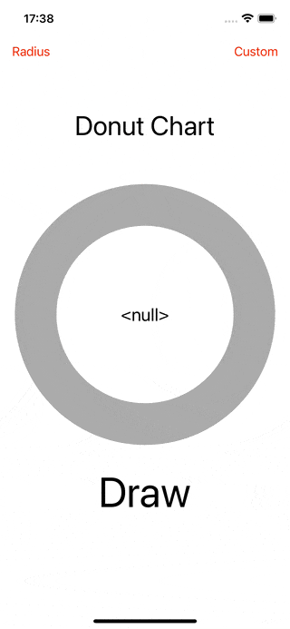
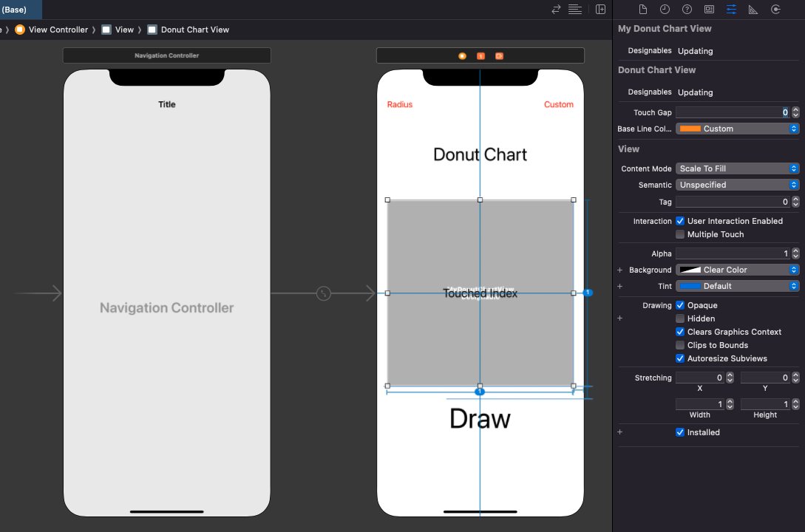

# WWDonutChartView

[](https://developer.apple.com/swift/) [](https://developer.apple.com/swift/)  [](https://developer.apple.com/swift/) [](https://developer.apple.com/swift/)

## [Introduction - 簡介](https://swiftpackageindex.com/William-Weng)
- [Simple donut chart.](https://blog.vizdata.tw/2018/02/how-to_26.html)
- [簡單的甜甜圈圖表。](https://www.canva.com/zh_tw/graphs/doughnut-charts/)



### [Installation with Swift Package Manager](https://medium.com/彼得潘的-swift-ios-app-開發問題解答集/使用-spm-安裝第三方套件-xcode-11-新功能-2c4ffcf85b4b)
```
dependencies: [
    .package(url: "https://github.com/William-Weng/WWDonutChartView.git", .upToNextMajor(from: "1.0.2"))
]
```



## [Function - 可用函式](https://gitbook.swiftgg.team/swift/swift-jiao-cheng)
|函式|功能|
|-|-|
|setting(lineWidth:baseLineColor:)|設定線寬 / 底線的顏色|
|drawing(lineCap:)|繪製動畫線條|
|clean()|清除線段|

## WWDonutChartViewDelegate
|函式|功能|
|-|-|
|informations(in:)|取得資料相關資訊|

## Example
```swift
final class ViewController: UIViewController {
    
    @IBOutlet weak var shapeLayerView: MyDonutChartView!
    
    private let infos: [WWDonutChartView.LineInformation] = [
        (strokeColor: .red, percent: 0.1, duration: 0.25),
        (strokeColor: .green, percent: 0.3, duration: 0.75),
        (strokeColor: .yellow, percent: 0.6, duration: 1.5),
    ]
    
    override func viewDidLoad() {
        super.viewDidLoad()
        shapeLayerView.delegate = self
    }
    
    @IBAction func drawAction(_ sender: UIButton) {
        shapeLayerView.drawing(lineCap: .butt)
    }
}

extension ViewController: WWDonutChartViewDelegate {
    
    func informations(in donutChartView: WWDonutChartView) -> [WWDonutChartView.LineInformation] {
        return infos
    }
}
```
